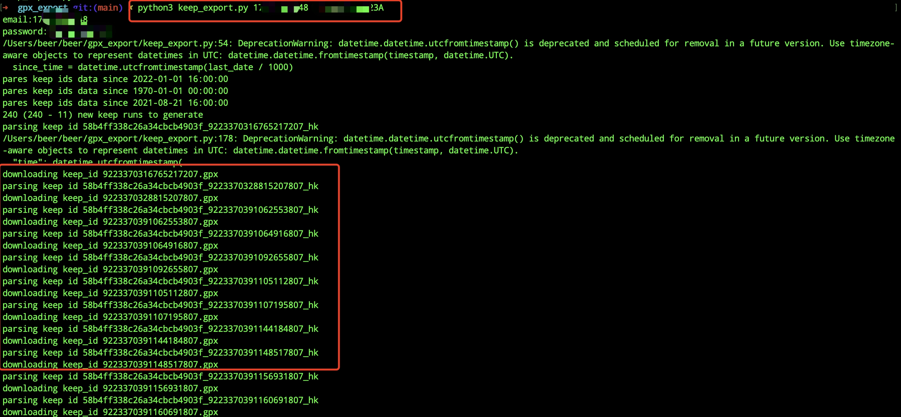

# gpx_export

gpx_export


### Usage

```
pip3 install -r requirements.txt 

# python3 keep_export.py <phone_number> <password>
python3 keep_export.py 175xxxx8548 xxxxx
```




### Reference

https://github.com/yihong0618/running_page
